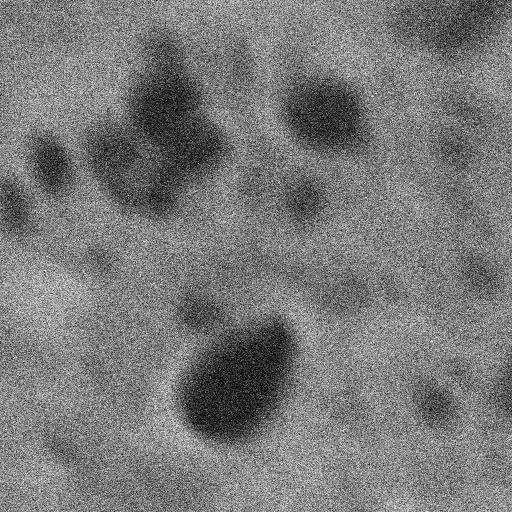
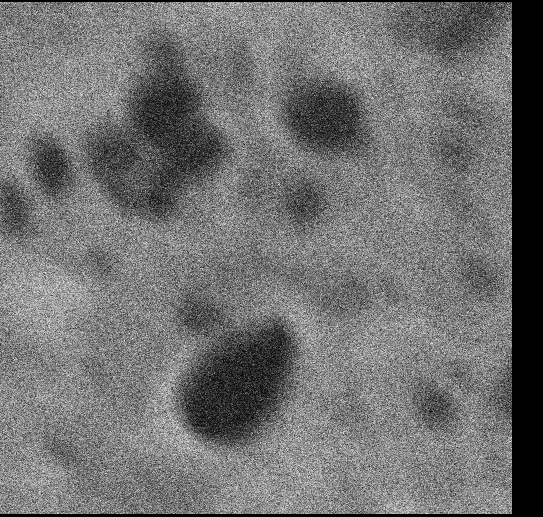

# GPU accelerated image registration

This package provides GPU accelerated image registration. It will fall back to CPU computation if GPU is not available.

For example, given this input:



This is the aligned image output:




## How to run the program
First, create the python environment if you do not have one set up already.
```
$ cd imagereg
$ conda create -n imagereg python=3.6.8 pip
$ source activate imagereg
$ pip install -r requirements.txt
$ pip install https://github.com/DeMarcoLab/imagereg.git
```


Then there are two options for running the program: from the command line, and from within python.

The `pipeline` image registration function takes three input arguments:
* The path to the input image directory
* The regex string describing the file naming. Filenames matching this regex are sorted alphabetically before image alignment.
* The path to an empty output directory where you would like to save the results. This *must* be an empty directory.

### 1. From the command line
```
conda activate imagereg
mkdir output_directory
python path/to/imagereg/main.py tests/images img[0-9].tif output_directory
```

### 2. From within python

```
$ conda activate imagereg
$ mkdir output_directory
$ python
>>> import imagereg
>>> imagereg.pipeline('tests/images', 'img[0-9].tif', 'output_directory')
```

## Setting up your development environment

1. Create the conda development environment

    ```
    conda create -n imagereg python=3.6.8 pip
    source activate imagereg
    pip install -r requirements/requirements-default.txt
    pip install -r requirements/requirements-dev.txt
    ```

2. Optional GPU setup, for accelerated performance. You must have a supported NVIDIA GPU.

    i. Install CUDA version 10.0 (see <https://docs.nvidia.com/cuda/>)
    
    ii. Install cupy into your imagereg conda environment:
    ```
    source activate imagereg
    pip install cupy==5.4.0
    ```

3. Fork and clone the repository at https://github.com/DeMarcoLab/imagereg.git

4. Install imagereg into your environment as an editable installation:
    ```
    cd imagereg
    pip install -e .
    ```

### Running the tests

We use pytest for our unit testing.

```
cd imagereg
pytest
```
